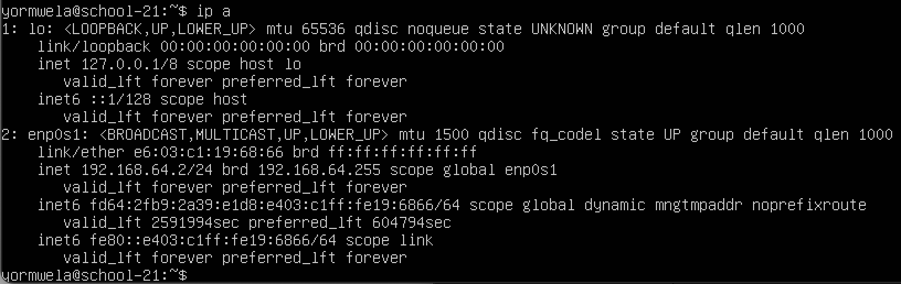
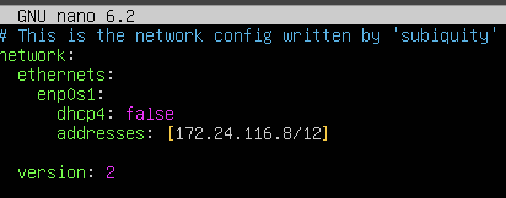
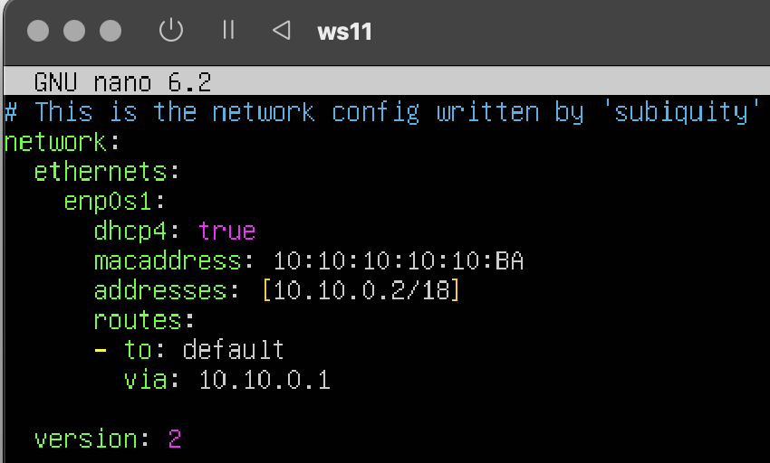
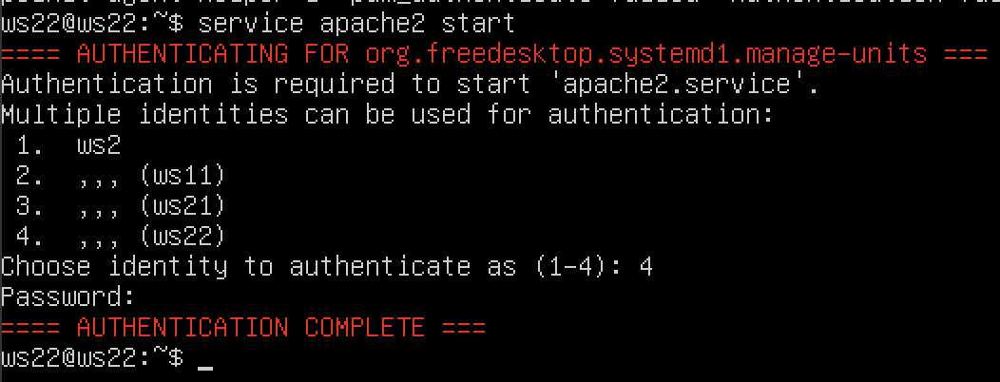
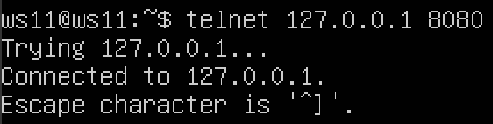

# Сети в Linux

Настройка сетей в Linux на виртуальных машинах.

## Содержание 

1. [Инструмент ipcalc](#part-1)
    1.1 [Сети и маски](#11-сети-и-маски) \
    1.2 [localhost](#12-localhost) \
    1.3 [Диапазоны и сегменты сетей](#13-диапазоны-и-сегменты-сетей) \
2. [Статическая маршрутизация между двумя машинами](#part-2-статическая-маршрутизация-между-двумя-машинами) \
    2.1 [Добавление статического маршрута вручную](#21-добавление-статического-маршрута-вручную) \
    2.2 [Добавление статического маршрута с сохранением](#22-добавление-статического-маршрута-с-сохранением) \
3. [Утилита `iperf3`](#part-3-утилита-iperf3) \
    3.1 [Скорость соединения](#31-скорость-соединения) \
    3.2 [Реализация утилита `iperf3`](#32-реализация-утилиты-iperf3) \
4. [Сетевой экран](#part-4-сетевой-экран) \
    4.1 [Утилита `iptables`](#41-утилита-iptables) \
    4.2 [Утилита `nmap`](#42-утилита-nmap) \
5. [Статическая маршрутизация сети](#part-5-статическая-маршрутизация-сети) \
    5.1 [Настройка адресов машин](#51-настройка-адресов-машин) \
    5.2 [Включение переадресации IP-адресов](#52-включение-переадресации-ip-адресов) \
    5.3 [Установка маршрута по-умолчанию](#53-установка-маршрута-по-умолчанию) \
    5.4 [Добавление статических маршрутов](#54-добавление-статических-маршрутов) \
    5.5 [Построение списка маршрутизаторов](#55-построение-списка-маршрутизаторов) \
    5.6 [Использование протокола ICMP при маршрутизации](#56-использование-протокола-icmp-при-маршрутизации) \
  6. [Динамическая настройка IP с помощью DHCP](#part-6-динамическая-настройка-ip-с-помощью-dhcp) \
  7. [NAT](#part-7-nat) \
  8. [Дополнительно. Знакомство с SSH Tunnels](#part-8-дополнительно-знакомство-с-ssh-tunnels)
    

## Part 1.

#### 1.1. Сети и маски

1. Адрес сети `192.167.38.54/13` - 192.167.38.54;

2. - Перевод маски `255.255.255.0`:
                                    - В префиксную : /24;
                                    - В двоичную : 11111111.11111111.11111111.00000000;
   - Перевод маски `/15`:
                                    - В обычную : 255.254.0.0;
                                    - В двоичную : 11111111.11111110.00000000.00000000;

   - Перевод маски `11111111.11111111.11111111.11110000`:
                                    - В обычную : 255.255.255.240;
                                    - В префиксную : /28;
3. Минимальный и максимальный хост в сети `12.167.38.4` при масках:
   - `/8`:
     - min: 12.0.0.1
     - max: 12.255.255.254
   - `11111111.11111111.00000000.00000000`:
     - min: 12.167.0.1
     - max: 12.167.255.254
   - `255.255.254.0`:
     - min: 12.167.38.1
     - max: 12.167.39.254
   - `/4`:
     - min: 0.0.0.1
     - max: 15.255.255.254

#### 1.2. localhost
`localhost` — это стандартное имя, которое используется для обращения к локальному компьютеру или к серверу на том же устройстве, на котором происходит запрос. По сути, это специальное доменное имя, которое указывает на собственное устройство.
`Ip-адрес localhost` обычно представлен как 127.0.0.1, также в диапазоне этого адреса считаются IP-адреса от 127.0.0.0 до 127.255.255.255, принадлежащие к сети loopback.

Определим  можно ли обратиться к приложению, работающему на localhost, со следующими IP: 
    - `194.34.23.100` - невозможно;
    - `127.0.0.2` - возможно;
    - `127.1.0.1` - возможно;
    - `128.0.0.1` - невозможно;

#### 1.3. Диапазоны и сегменты сетей
Служба распределения номеров `IANA (Internet Assigned Numbers Authority)` зарезервировала для частных сетей три блока адресов:
- 10.0.0.0 - 10.255.255.255 (префикс 10/8)
- 172.16.0.0 - 172.31.255.255 (префикс 172.16/12)
- 192.168.0.0 - 192.168.255.255 (префикс 192.168/16)

1. **Соответственно классифицировать адреса из задания можем так**:
  - *частные*:
     - `10.0.0.45`
     - `192.168.4.2`
     - `172.20.250.4`
     - `172.16.255.255`
     - `10.10.10.10`

  - *публичные*:
     - `134.43.0.2`
     - `172.0.2.1`
     - `192.172.0.1`
     - `172.68.0.2`
     - `192.169.168.1`

2. **Какие из перечисленных IP адресов шлюза возможны у сети `10.10.0.0/18`:**

  - *возможны*:
    - `10.10.0.2`
    - `10.10.10.10`
    - `10.10.1.255`

  - *невозможны*:
    - `10.0.0.1`
    - `10.10.100.1`

## Part 2. Статическая маршрутизация между двумя машинами

  - **Использование команды `ip a`**:
    - 1-ая машина 
        

    - 2-ая машина
        

  - **Описание сетевого интерфейса внутренней сети**:

  В нашем случае внутренней сетью является `enp0s1` из вывода команды `ip a`, можем вывести следующие данные:

  - МТУ (MTU): 1500
        Объяснение: Максимальный размер передаваемого пакета для интерфейса `enp0s1`.
  - Состояние: UP (активен), LOWER_UP (физический интерфейс активен)
  - Параметры передачи данных через сеть:
         - BROADCAST (Широковещательный адрес)
         - MULTICAST (Многоадресная передача)
  - MAC-адрес: 66:10:98:86:ac:9f
           Объяснение: Физический адрес сетевого устройства.
  - Адресация IPv4:
         - IP-адрес: 192.168.64.4
         - Маска подсети: /24
         - Глобальное область действия: scope global dynamic
  - Адресация IPv6:
         - IP-адрес: fe80::6410:98ff:fe86:ac9f
         - Маска подсети: /64
         - Область действия: scope link (локальный для соединения)

##### Для машин задаем Ip и netmask:
   - `ws1` 
   - `ws2` 

##### Выполняю команду `netplan apply` для перезапуска сервиса сети:
   - `ws1` 
   - `ws2` 

#### 2.1. Добавление статического маршрута вручную

- ##### Добавляю статический маршрут от одной машины до другой и обратно при помощи команды вида `ip r add` и пингу соединение:
   - `ws1` 

   - `ws2` 

#### 2.2. Добавление статического маршрута с сохранением

- ##### Перезапускаю машины 

- ##### Добавляю статический маршрут от одной машины до другой с помощью файла `etc/netplan/00-installer-config.yaml`:

   - `ws1` 

   - `ws2` 

- ##### Перезапускаю машины и пингую соединение между ними:

   - `ws1` 

   - `ws2` 

## Part 3. Утилита `iperf3`
#### 3.1. Скорость соединения

##### Перевести и записать в отчёт: `8 Mbps в MB/s, 100 MB/s в Kbps, 1 Gbps в Mbps`

- 8 Mbps = 1 MB/s
- 100 MB/s = 819200 Kbps
- 1 Gbps = 1024 Mbps

#### 3.2.  Реализация утилиты `iperf3`

##### Измерить скорость соединения между ws1 и ws2

   - `ws1` 
    - неоходимо обратить внимание , что при использовании `iperf3`, одну машину задаем как сервер а со второй проверяем скорость 

   - `ws2` 

## Part 4. Сетевой экран

#### 4.1. Утилита **iptables**

  - `ws1` 

  - `ws2` 

Правила выполняться сверху-вниз, следовательно, если правило запрета находиться выше оно срабатывает, а правило разрешения находящиеся ниже нет.

#### 4.2. Утилита **nmap**

   - `ws1` 

   - `ws2` 

Видно что отчет `nmap` выводит `Host is up`.

## Part 5. Статическая маршрутизация сети

#### 5.1. Настройка адресов машин
- Настройка конфигурации машин в etc/netplan/00-installer-config.yaml согласно сети на рисунке:
  - **ws11**
  

  - **ws21**
  

  - **ws22**
  

  - **r1**
  

  - **r2**
  
- Перезапустил сервис сети. Командой `ip -4 a` проверил, что адреса машин заданы верно:

  - **ws11**
  

  - **ws21**
  

  - **ws22**
  

  - **r1**
  

  - **r2**
  

- Пропинговал ws22 с ws21:

  - **ws22 с ws21**
  

  - **ws21 с ws22**
  

- Пропинговал r1 с ws11:

  - **ws11 с r1**
  

  - **r1 с ws11**
  

#### 5.2. Включение переадресации IP-адресов

- Для включения переадресации IP, выполню команду на роутерах: `sysctl -w net.ipv4.ip_forward=1`
*При таком подходе переадресация не будет работать после перезагрузки системы*

  - **r1**
  

  - **r2**
  

- Откройте файл `/etc/sysctl.conf` и добавьте в него следующую строку `sysctl -w net.ipv4.ip_forward=1`:
*При использовании этого подхода, IP-переадресация включена на постоянной основе*

  - **r1**
  

  - **r2**
  

#### 5.3. Установка маршрута по-умолчанию

- Настроил маршруты по-умолчанию (шлюз) для рабочих станций. Для этого добавил default перед IP роутера в файле конфигураций.

  - **ws11**
  

  - **ws21**
  

  - **ws22**
  
- Вызовал `ip r` и показал, что добавился маршрут в таблицу маршрутизации

  - **ws11**
  

  - **ws21**
  

  - **ws22**
  

- Пропинговал с ws11 роутер r2 и показал на r2, что пинг доходит. Для этого использую команду
`tcpdump -tn -i eth0` :

  - **ws11**
  
  
  - **r2**
  

#### 5.4. Добавление статических маршрутов

- Добавил в роутеры r1 и r2 статические маршруты в файле конфигураций:

  - **r1**
  

  - **r2**
  

- Вызовал ip r и покажи таблицы с маршрутами на обоих роутерах:
  
  - **r1**
  
  
  - **r2**
  

- Запустил команды на ws11:

  - 
  Маршрут для сети 10.10.0.0/18 сети более конкретный и подробный, чем маршрут по умолчанию 0.0.0.0/0. Более специфический маршрут обычно имеет более высокий приоритет при принятии решения о маршрутизации.

#### 5.5. Построение списка маршрутизаторов

- При помощи утилиты traceroute построил список маршрутизаторов на пути от ws11 до ws21.

  - **ws1**
  

  - **r1**
  

- `traceroute` - это утилита в сетевых операционных системах, таких как Linux и Windows, которая используется для отслеживания маршрута сетевых пакетов от отправителя до указанного удаленного узла. `traceroute` помогает идентифицировать промежуточные узлы (маршрутизаторы), через которые проходят пакеты, и определить время задержки для каждого из них.

Вот как работает `traceroute`:

  - Когда вы запускаете `traceroute` и указываете IP-адрес или доменное имя удаленного узла, ваш компьютер начинает отправлять серии ICMP (или UDP) пакетов к удаленному узлу.

  - Каждый пакет делает "прыжок" через сеть от вашего компьютера к удаленному узлу через различные маршрутизаторы.

  - Для каждого прыжка маршрутизатор отвечает на ICMP-запрос `traceroute` и отправляет обратно информацию о своем IP-адресе, времени пинга и т.д.

  - `traceroute` выводит информацию о каждом промежуточном узле, его IP-адрес, время задержки (ping), а также количество прыжков (Hop Count), через которые проходит пакет.

  - После отправки определенного количества пакетов (обычно 3 для каждого узла), `traceroute` завершается, показывая итоговый маршрут к указанному удаленному узлу.

#### 5.6. Использование протокола ICMP при маршрутизации

- Запустил на r1 перехват сетевого трафика, проходящего через eth0 с помощью команды:
`tcpdump -n -i eth0 icmp`

  - **r1**
  

- Пропинговал с ws11 несуществующий IP (например, 10.30.0.111) с помощью команды:
`ping -c 1 10.30.0.111`  

  - **ws11**
  

## Part 6. Динамическая настройка IP с помощью DHCP

- Устанавливаем службу DHCP командой: `sudo apt install isc-dhcp-server`

- **r2**:
  - Содержимое файла */etc/dhcp/dhcpd.conf* 
  
 
  - Содержимое файла */etc/resolv.conf* 
  

  - Перезагрузка службу **DHCP** командой `systemctl restart isc-dhcp-server` для R2 \
  

  - Перезагрузка WS21 командой: `sudo reboot`

  - Проверка полученного адреса WS21 командой: `ip a` \
  

  - Пинг WS11 с WS21 командой: `ping -c 4 10.20.0.8` \
  

- **r1**  

  - Содержимое файла *etc/netplan/00-installer-config.yaml* для WS11 \
  

  - Содержимое файла */etc/dhcp/dhcpd.conf* для R1 \
  

  - Содержимое файла */etc/resolv.conf* для R1 \
  

  - Перезагрузка службу **DHCP** командой `systemctl restart isc-dhcp-server` для R1 \
  

  - Перезагрузка WS11 командой: `sudo reboot`

  - Проверка полученного адреса WS11 командой: `ip a` \
  

  - Пинг WS22 с WS11 командой: `ping -c 4 10.10.0.7` \
  

- Запросил с ws21 обновление ip адреса.

  -  Смотрим IP до обновления с WS21 командой: `ip a` \
  

  -  Запрашиваем обновление IP адреса с WS21 командой: `sudo dhclient`
  -  Смотрим IP после запроса с WS21 командой: `ip a` \

  - 
  Видим что присвоился другой IP

## Part 7. NAT

- Устанавливаем `apache2` с помощью команды `sudo apt install apache2`
- В файле `/etc/apache2/ports.conf` на ws22 и r1 изменяю строку Listen 80 на Listen 0.0.0.0:80
  - **r1**
  

  - **ws22**
  

- Запускаю веб-сервер Apache командой `service apache2 start` на ws22 и r1.
  - **r1**
  

  - **ws22**
  

- Добавляю в фаервол, созданный по аналогии с фаерволом из Части 4, на r2 следующие правила:
  - 
  Где: 
      - Удаление правил в таблице `filter - iptables -F`;
      - Удаление правил в таблице "NAT" - `iptables -F -t nat`;
      - Отбрасывать все маршрутизируемые пакеты - `iptables --policy FORWARD DROP`.  
- Запустил фаерволл командой `sudo sh /etc/firewall.sh`
- Проверил соединение между ws22 и r1 командой `ping.`
  - **ws22 to r1**
  

  - **r1 to ws22**
  

- Добавляем в файл ещё одно правило: Разрешить маршрутизацию всех пакетов протокола ICMP.
  - 

- Проверяем соединение между ws22 и r1 командой ping.
  - **ws22 to r1**
  

  - **r1 to ws22**
  

- Добавляем в файл еще два правила
  - 

- Проверяем соединение по TCP для SNAT: для этого с ws22 подключаемся к серверу Apache на r1 командой `telnet [адрес][port]`
  - 

- Проверяем соединение по TCP для DNAT: для этого с r1 подключиться к серверу Apache на ws22 командой telnet (обращаемся по адресу r2 и порту 8080).
  - 

## Part 8. Дополнительно. Знакомство с SSH Tunnels

Направление трафика в пределах одной локальной сети.

- Запускаем на R2 фаервол с правилами из Части 7 командой `sudo sh /etc/firewall.sh`

- Запустили веб-сервер Apache на ws22 только на localhost , с помощью команды `service apache2 start`
  - 

- Используя Local TCP forwarding с ws21 до ws22, получили доступ к веб-серверу на ws22 с ws21.
  - 

- Для проверки выполняем команду `telnet 127.0.0.1 [локальный порт]`
  - 

- Используя Remote TCP forwarding c ws11 до ws22, чтобы получить доступ к веб-серверу на ws22 с ws11.
  - 
  
- Для проверки выполняем команду `telnet 127.0.0.1 [локальный порт]`
  -  

